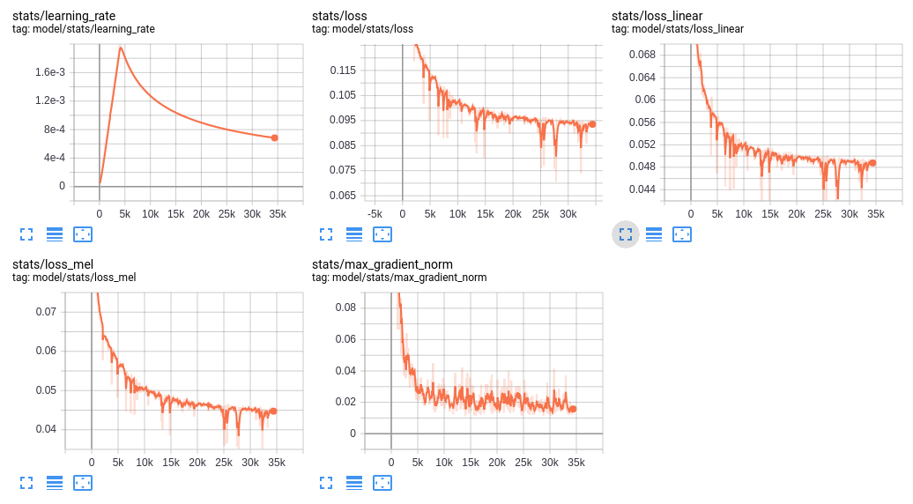

# GST Tacotron (expressive end-to-end speech syntheis using global style token)

A tensorflow implementation of the [Style Tokens: Unsupervised Style Modeling, Control and Transfer in End-to-End Speech Synthesis](https://arxiv.org/abs/1803.09017) and [Towards End-to-End Prosody Transfer for Expressive Speech Synthesis with Tacotron](https://arxiv.org/abs/1803.09047).

## Audio Samples

* **[Audio Samples](https:///t04glovern.github.io/gst-tacotron/)** from models trained using this repo with default hyper-params.
  * This set was trained using the [Blizzard 2013 dataset](http://www.cstr.ed.ac.uk/projects/blizzard/2013/lessac_blizzard2013/) with and without global style tokens (GSTs).
    * I found the synthesized audio can learn the prosody of the reference audio.
    * The audio quality isn't so good as the paper. Maybe more data, more training steps and the wavenet vocoder will improve the quality, as well as better attention mechanism.

## Quick Start

### Installing dependencies

#### Python Pip

* Install Python 3.
* Install the latest version of [TensorFlow](https://www.tensorflow.org/install/) for your platform. For better performance, install with GPU support if it's available. This code works with TensorFlow 1.4.
* Install requirements:

  ```bash
  pip install -r requirements.txt
  ```

#### Conda

* Create and activate the conda environment

  ```bash
  conda env create -f environment.yml
  conda activate tacotron
  ```

### Pre-trained model

1. **Download and unpack a model**:

   ```bash
   aws s3 sync s3://devopstar/gst-tacotron/ logs-tacotron/
   ```

2. **Run the demo server**:

   ```bash
   python3 demo_server.py --checkpoint logs-tacotron/model.ckpt-204000
   ```

3. **Point your browser at localhost:9000**

   * Type what you want to synthesize

### Training

*Note: you need at least 40GB of free disk space to train a model.*

1. **Download a speech dataset.**

    The following are supported out of the box:
    * [LJ Speech](https://keithito.com/LJ-Speech-Dataset/) (Public Domain)
    * [Blizzard 2013](http://www.cstr.ed.ac.uk/projects/blizzard/2013/lessac_blizzard2013/) (Creative Commons Attribution Share-Alike)

2. **Unpack the dataset into `database`**

    After unpacking, your tree should look like this for LJ Speech:

    ```bash
    database
      |- LJSpeech-1.1
          |- metadata.csv
          |- wavs
    ```

    or like this for Blizzard 2013:

    ```bash
    database
      |- Blizzard2013
          |- ATrampAbroad
          |   |- sentence_index.txt
          |   |- lab
          |   |- wav
          |- TheManThatCorruptedHadleyburg
              |- sentence_index.txt
              |- lab
              |- wav
    ```

3. **Preprocess the data**

    ```bash
    python3 preprocess.py --dataset ljspeech
    ```

     * Use `--dataset blizzard` for Blizzard data

4. **Train a model**

    ```bash
    python3 train.py
    ```

    The above command line will use default hyperparameters, which will train a model with cmudict-based phoneme sequence and 4-head multi-head sytle attention for global style tokens. If you set the `use_gst=False` in the hparams, it will train a model like Google's another paper [Towards End-to-End Prosody Transfer for Expressive Speech Synthesis with Tacotron](https://arxiv.org/abs/1803.09047).

    Tunable hyperparameters are found in [hparams.py](hparams.py). You can adjust these at the command line using the `--hparams` flag, for example `--hparams="batch_size=16,outputs_per_step=2"` . Hyperparameters should generally be set to the same values at both training and eval time.

5. **Monitor with Tensorboard** (optional)

    ```bash
    tensorboard --logdir ./logs-tacotron
    ```

    Open [http://localhost:6006](http://localhost:6006)

    

    The trainer dumps audio and alignments every 1000 steps. You can find these in ./logs-tacotron.

6. **Synthesize from a checkpoint**

    ```bash
    python3 eval.py --checkpoint logs-tacotron/model.ckpt-185000 --text "hello text" --reference_audio /path/to/ref_audio
    ```

    Replace "185000" with the checkpoint number that you want to use. Then this command line will synthesize a waveform with the content "hello text" and the style of the reference audio. If you don't use the `--reference_audio`, it will generate audio with random style weights, which may generate unintelligible audio sometimes.

    If you set the `--hparams` flag when training, set the same value here.

## Notes

Since the paper didn't talk about the details of the style-attention layer, I'm a little confused about the global style tokens. For the token embedding (GSTs) size, the paper said that they set the size to 256/h, where `h` is the number of heads. I'm not sure whether I should initialize the same or different GSTs as attention memory for all heads.

## Reference

* Fork of syang1993's implementation of tacotron: [https://github.com/syang1993/gst-tacotron](https://github.com/syang1993/gst-tacotron)
* Keithito's implementation of tacotron: [https://github.com/keithito/tacotron](https://github.com/keithito/tacotron)
* Yuxuan Wang, Daisy Stanton, Yu Zhang, RJ Skerry-Ryan, Eric Battenberg, Joel Shor, Ying Xiao, Fei Ren, Ye Jia, Rif A. Saurous. 2018. [Style Tokens: Unsupervised Style Modeling, Control and Transfer in End-to-End Speech Synthesis](https://arxiv.org/abs/1803.09017)
* RJ Skerry-Ryan, Eric Battenberg, Ying Xiao, Yuxuan Wang, Daisy Stanton, Joel Shor, Ron J. Weiss, Rob Clark, Rif A. Saurous. 2018. [Towards End-to-End Prosody Transfer for Expressive Speech Synthesis with Tacotron](https://arxiv.org/abs/1803.09047).
